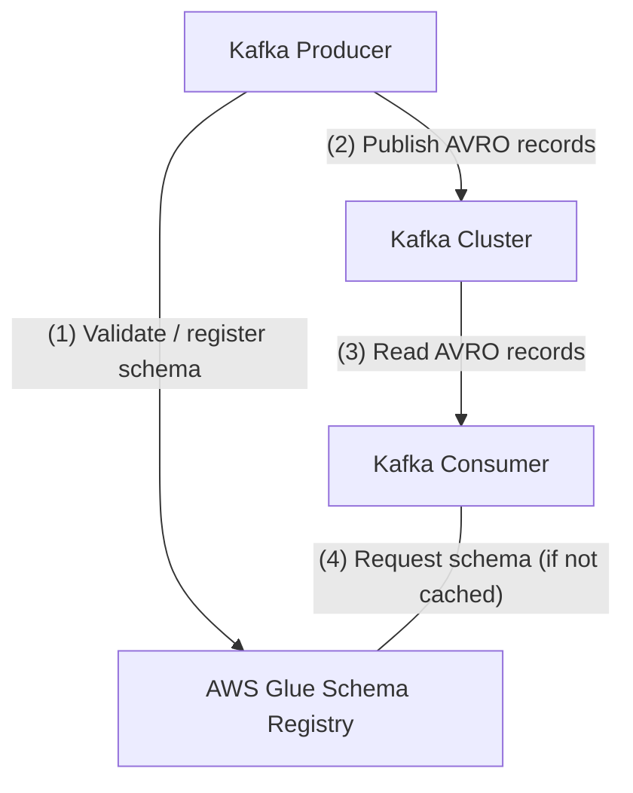

# Glue Schema Registry with MSK

| Key          | Value                                                    |
| ------------ | -------------------------------------------------------- |
| Services     | MSK, Glue Schema Registry, Glue ETL, RDS                |
| Integrations | AWS CLI, Maven                                           |
| Categories   | Streaming; Analytics; Schema Evolution                   |

## Introduction

A demo application illustrating schema evolution with AWS Glue Schema Registry and AWS Managed Streaming for Kafka (MSK) using LocalStack. The sample demonstrates Kafka producers registering and validating Avro schemas, Kafka consumers reading schema-encoded records, and the full schema evolution lifecycle with compatibility enforcement.

## Prerequisites

- A valid [LocalStack for AWS license](https://localstack.cloud/pricing). Your license provides a [`LOCALSTACK_AUTH_TOKEN`](https://docs.localstack.cloud/getting-started/auth-token/) to activate LocalStack.
- [Docker](https://docs.docker.com/get-docker/)
- [`localstack` CLI](https://docs.localstack.cloud/getting-started/installation/#localstack-cli)
- [`awslocal` CLI](https://docs.localstack.cloud/user-guide/integrations/aws-cli/)
- [Java 11](https://openjdk.org/) and [Maven 3](https://maven.apache.org/)

## Check prerequisites

```bash
make check
```

## Installation

```bash
make install
```

The install target installs LocalStack and `awslocal`. Please also manually install Maven 3 and Java 11. Verify your versions:

```sh
$ mvn --version
Apache Maven 3.6.3
Maven home: /usr/share/maven
Java version: 11.0.15, vendor: Private Build, runtime: /usr/lib/jvm/java-11-openjdk-amd64
```

## App Details

This example shows how to use the AWS Glue Schema Registry in combination with MSK.



The example first performs a basic workflow:
- Create a Kafka Cluster (MSK), a Glue Schema Registry, and a Schema with `BACKWARD` compatibility.
- A Kafka Producer (`producer`) sends 100 Avro-encoded records, validating against the registered schema (1) and publishing to Kafka (2).
- A Kafka Consumer (`consumer`) reads the records (3) and fetches the schema from the registry if not cached (4).

Then a more advanced schema evolution showcase:
- A second producer (`producer-2`) registers a new backward-compatible schema version.
- The registry returns a jsonpatch-diff of the two schema versions.
- Running the original consumer (`consumer`) against records from `producer-2` _fails_ — the schemas are incompatible.
- A third producer (`producer-3`) tries to register a schema that is _not_ backward-compatible — registration _fails_.
- A second consumer (`consumer-2`) compatible with `producer-2`'s schema runs successfully.

## Start LocalStack

```bash
export LOCALSTACK_AUTH_TOKEN=<your-auth-token>
make start
```

## Run the application

### Interactive Mode

After each step, you will be asked to press any key to proceed:

```sh
make run-interactive
```

### Quiet Mode

Execute all steps without interruption:

```bash
make run
```

## License

This code is available under the Apache 2.0 license.
